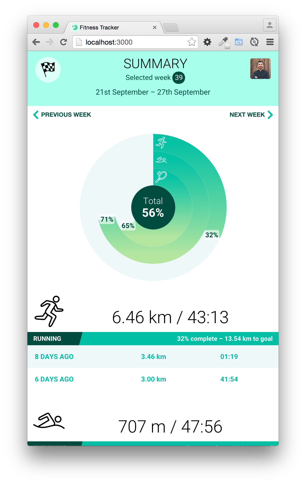

Fitness Tracker Demo
====================

Fitness Tracker Demo is a Polymer-based client-side demo application, which
uses elements from the [Polymer Catalog](https://elements.polymer-project.org/), [Vaadin Grid](http://vaadin.com/components) and [Vaadin Charts](http://vaadin.com/charts).



Development
-----------

Clone this repository and run the following command(s) to start the application
for development.

```npm install && bower install && gulp```


Deployment
----------

Clone this repository and run the following command(s) to package the application
for deployment.

```npm install && bower install && gulp dist```

This will result in a distributable application in the ```dist``` subdirectory.
